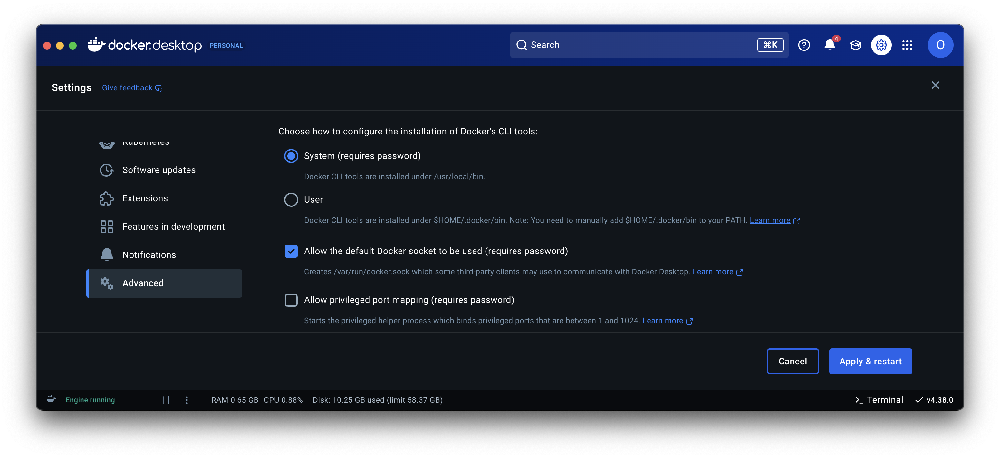

# API

## How to run the API for testing

### Installing AWS and SAM
- Install the AWS CLI and configure your credentials. (We did this in class, but if needed, the process is detailed [here](https://docs.aws.amazon.com/serverless-application-model/latest/developerguide/prerequisites.html)).
- Install the SAM CLI; instructions are available [here](https://docs.aws.amazon.com/serverless-application-model/latest/developerguide/install-sam-cli.html).

### Locally
- If any changes have been made to `template.yaml`, run `sam validate` to check for errors.
- Make sure to install [Docker](https://www.docker.com/get-started/)    
  - allow the default Docker socket to be used (info [here](https://stackoverflow.com/a/77926411)).
  - If you're having CORS issues when using local dev environment and the `docker` command in the terminal is not found: 
    - Go to Docker Desktop -> settings -> advanced. Change the docker CLI install location to the other location (i.e. System -> User), click `Apply & restart`, then switch it back and click `Apply & restart` again.
  
    - This will remake the symlink from docker to CLI
    - We think this was caused by the fix to the docker malware issue earlier in the semester.
- To run locally, use `sam build` and then `sam local start-api`.
- The API should be running at `http://127.0.0.1:3000`. 

### On AWS
#### Automated Deployment
- Ensure the `samconfig.toml` file is correctly configured for automated deployments. This file contains configuration parameters that SAM CLI uses to deploy your application without manual input.
- Run `sam deploy --config-file samconfig.toml --config-env default --resolve-s3` to deploy using the default environment settings.
  - `--config-file` specifies the configuration file to use.
  - `--config-env` specifies the environment within the configuration file to use for deployment parameters.
  - SAM needs a place to put the deployment artifacts. `--resolve-s3` instructs SAM CLI to automatically handle the creation or identification of an S3 bucket for storing the deployment artifacts if not already specified. This ensures that the deployment package has a place to be stored without manual setup.

#### Understanding `samconfig.toml`
The `samconfig.toml` file stores configuration parameters for SAM CLI deployments. Here’s what each field represents:
- `stack_name`: Name of the AWS CloudFormation stack.
- `region`: AWS region where the resources will be deployed.
- `confirm_changeset`: Whether to prompt for confirmation before applying changes (set to `false` for no prompts).
- `capabilities`: Permissions the SAM CLI needs to deploy resources, typically including IAM capabilities.
- `disable_rollback`: Whether AWS CloudFormation should rollback changes if a deployment fails.

#### Endpoints and Sync
- Run `sam list endpoints --output json` to get the link for the endpoint you're testing.
- To update the API on AWS in real-time, use `sam sync --watch`.
    - Note: This may take a couple of minutes to start up.
    - It is ready once you see `Infra sync completed.`

#### Clean Up
- Use `sam delete` when done to avoid leaving resources up, which might incur costs.

This README has been adapted to utilize the automated deployment features of AWS SAM, making it easier and faster to manage your deployments. 

For more detailed information, refer to this [AWS Tutorial](https://docs.aws.amazon.com/serverless-application-model/latest/developerguide/serverless-getting-started-hello-world.html#serverless-getting-started-hello-world-delete).
