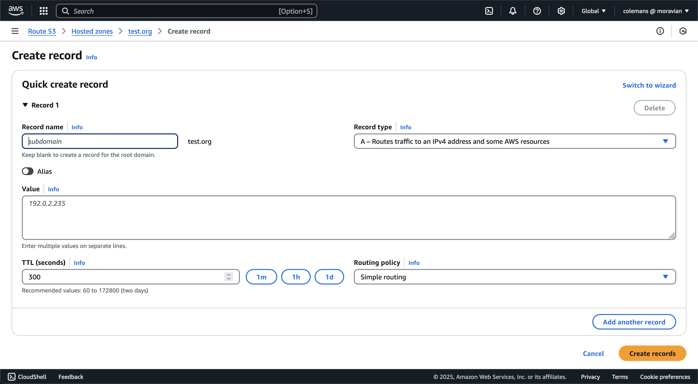

# How to set up a static domain for an API Gateway
## Prerequisites
- Have an API with a deployed stage. (see [this tutorial](https://docs.aws.amazon.com/apigateway/latest/developerguide/getting-started.html))
- Have your domain registered in Route 53 (ask Coleman)
- Have an ACM (amazon certificate manager) certificate for your subdomain.
    - Create a Hosted Zone in Route 53:
        - Go to Route 53 -> Hosted Zones -> Create Hosted Zone. 
        - Make the domain name the top level of your subdomain and click "Create hosted zone" at the bottom of the page.
    - Create a CNAME Record in that hosted zone:
        - Click on the "Create record" button. 
        - Select "Simple routing," click "Next," then click "Define simple record."
            - If there is no "Simple routing" box click "Switch to wizard" in the top right. 
        - Enter your subdomain, use record type "CNAME," type the upper level domain into the value entry box, and click "Define simple record." 
    - Create a certificate in ACM:
        - Go to AWS Certificate Manager and click "Request a certificate."
        - Select "Request a public certificate" and click "Next".
        - Enter your full subdomain into the "Fully qualified domain name" field, select "DNS validation," and click "Request." 
        - Click "create records in Route 53."
        - Your Certificate status should update to "Issued" in less than a minute. If it takes any longer than 10 minutes, double check your work.
    - Remove original CNAME record:
        - Go to Route 53 -> Hosted Zones -> your hosted zone.
        - Select the CNAME record and click delete record.
## Process
- Enter Domain into API Gateway:
    - Go to API Gateway -> "Custom Domain names" and click "Add domain name."
    - Enter your subdomain, select your certificate, and click "Add domain name." 
- Map your domain to your API:
    - Click "Configure API mappings."
    - Select your API and stage from the drop downs and click "Save."
        - "Path" is not needed for a regular API.
- Route Route 53 Record to API:
    - Go to Route 53 -> Hosted Zones.
    - Create a hosted zone for your upper level domain and record for subdomain. (see certificate tutorial in Prerequisites)
        - Instead of selecting "CNAME" when defining the record, select "A" for Record type, choose the endpoint "Alias to API Gateway," and select your region and API.
- You should now be able to run `curl https://<your_subdomain>/<endpoint>` and see the correct return value.

Adapted from [this](https://docs.aws.amazon.com/apigateway/latest/developerguide/how-to-custom-domains.html) AWS Documentation.
